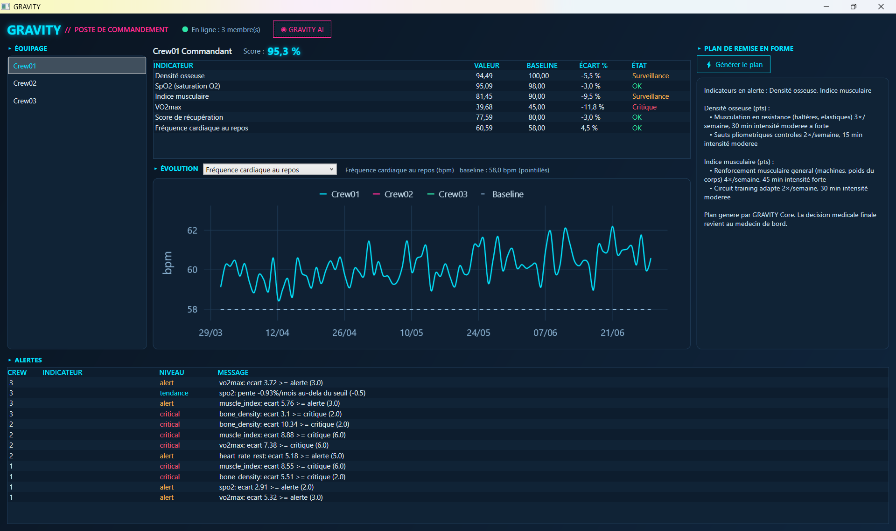

# GRAVITY

## Sommaire
1. [Groupe](#groupe)
2. [Idée](#idée)
3. [Objectif](#objectif)
4. [Fonctionnement](#fonctionnement)
   - [Base de données](#base-de-données)
   - [Arduino](#arduino)
   - [Dashboard & IA](#dashboard--ia)
5. [Organisation](#organisation)
6. [Synthèse](#synthèse)

---

## Groupe 

<strong>Équipe Projet GRAVITY - Workshop 2026 :</strong>
<ul>
   <li>Tasnim Alioui</li>
   <li>Rémi Pernak</li>
   <li>Imran Lamkadem</li>
   <li>Thomas Lesage</li>
</ul>

## Idée 

Une mission spatiale longue durée pose un problème médical concret : en microgravité, le corps humain se dégrade de façon lente et mesurable (perte de densité osseuse, fonte musculaire, baisse des capacités cardiovasculaires).

Sur Terre, une équipe médicale surveillerait ces constantes en temps réel. Mais en raison des délais de communication spatiale de plusieurs minutes, la surveillance doit vivre à bord, sans dépendre d'Internet ni d'un lien permanent.

GRAVITY est né de ce constat : créer un système de santé connecté embarqué et autonome fonctionnant selon le principe « offline-first ».

## Objectif 

GRAVITY remplit trois missions principales :

1. <strong>Suivre l'évolution physiologique</strong> de chaque membre d'équipage par rapport à son état de référence mesuré avant le départ (sa « baseline »).

2. <strong>Détecter les dérives</strong> avant qu'elles ne deviennent des problèmes critiques, grâce à une analyse à trois niveaux (écart instantané, tendance sur un mois et score de santé composite).

3. <strong>Proposer des contre-mesures physiques adaptées</strong> via la génération de plans d'entraînement correctifs et répondre aux questions de l'équipage grâce à une IA conversationnelle locale.

## Fonctionnement 

Le système fonctionne en boucle continue : le collecteur (ou simulateur) transmet les mesures au cœur du système (GRAVITY Core sur FastAPI), qui les valide et les enregistre.

À chaque mesure, l'état de santé est réévalué. 
Le Dashboard interroge en permanence ce cœur pour afficher l'état de l'équipage, tandis que l'IA consulte le système via « Tool Calling » pour répondre de façon fiable aux questions.

### Base de données 
*(Réalisé par : Thomas Lesage)*

La base de données repose sur <strong>PostgreSQL</strong> et constitue l'historique complet de la mission (membres, baselines pré-mission, mesures physiologiques, seuils d'alerte, événements et alertes).

#### Modèle Conceptuel de Données (MCD)

| Entité | Description | Attributs principaux |
|---|---|---|
| **Membre de l'équipage** | Un astronaute suivi par le système. | `identifiant`, `nom` *(Crew01…)*, `rôle` |
| **Baseline** | État physiologique de référence mesuré avant le départ. | `indicateur`, `valeur de référence`, `date d'enregistrement` |
| **Mesure** | Valeur relevée sur un indicateur à une date donnée. | `indicateur`, `valeur`, `date de mission`, `date de réception` |
| **Seuil d'alerte** | Paramètres de détection d'écart et de tendance[cite: 1]. | `indicateur`, `écart alerte/critique`, `pente max tolérée` |
| **Événement** | Fait de mission (blessure, fatigue, etc.). | `type`, `détails`, `date de mission` |
| **Alerte** | État courant d'un indicateur dégradé mis à jour en continu[cite: 1]. | `indicateur`, `niveau`, `message`, `date de création` |

Le modèle gère le <strong>double horodatage</strong> (date de mission simulée et date réelle de réception), permettant d'accélérer le temps sans corrompre les calculs de tendance.

### Arduino 
*(Réalisé par : Tasnim Alioui & Rémi Pernak)*

Dans la version réelle du système, un module <strong>Arduino</strong> (ou Raspberry Pi) fait office de collecteur physique. Il capture les métriques physiologiques depuis des capteurs embarqués et les transmet au GRAVITY Core sous forme de structures JSON standardisées. Un simulateur logiciel en Python permet également de générer ces flux pour tester les scénarios de dérive sur plusieurs mois.

### Dashboard & IA 
*(Réalisé par : Imran Lamkadem & Thomas Lesage)*

Le <strong>Dashboard (Poste de Commandement)</strong> est développé en C# WPF. Il offre une vue complète sur l'état de santé de l'équipage, les alertes en temps réel et les plans de remise en forme générés.

#### Fonctionnalités de l'interface :
- <strong>Suivi individuel et score global :</strong> Consultation du score de santé (ex. Crew01 à 95,3 %), de la liste des indicateurs (densité osseuse, $SpO_2$, $VO_2max$, etc.) avec leur écart % et leur état (OK, Surveillance, Critique).
- <strong>Graphique d'évolution :</strong> Visualisation des tendances temporelles par rapport à la baseline (en pointillés).
- <strong>Tableau des alertes :</strong> Suivi des alertes en cours triées par niveau (alert, tendance, critical).
- <strong>Plans de remise en forme adaptatifs :</strong> Génération automatique d'exercices correctifs ajustés selon les blessures (ex. musculation en résistance, sauts pliométriques).
- <strong>Assistant IA intégré (GRAVITY AI) :</strong> Le dashboard dispose d'un bouton dédié <strong>GRAVITY AI</strong> permettant d'ouvrir une fenêtre de chat conversationnel. Les membres de l'équipage peuvent poser leurs questions directement en langage naturel (ex. <em>« comment va Crew02 ? »</em>). L'IA (modèle local Qwen 14B via Ollama) interroge le cœur via <em>Tool Calling</em> pour récupérer les données réelles et fournir une réponse précise sans jamais altérer ni halluciner les données de la base.

## Organisation 
*(Réalisé par : Rémi Pernak)*

Pour assurer un suivi rigoureux et une bonne coordination de l'équipe, nous avons mis en place :
<ul>
  <li><strong>Gestion de projet GitHub :</strong> Création d'un dépôt GitHub centralisant l'ensemble du code source, ainsi que d'un projet GitHub (Kanban / Project Board) pour lister, attribuer et planifier les différentes tâches techniques au sein de l'équipe.</li>
</ul>

Le développement s'est structuré selon le phasage suivant :
1. <strong>Modélisation & BDD :</strong> Conception du MCD Merise et déploiement de PostgreSQL.
2. <strong>Cœur & Moteur de règles (GRAVITY Core) :</strong> Développement de l'API FastAPI pour traiter les mesures, déceler les dérives (écarts instantanés, pentes sur 30 jours) et calculer le score composite.
3. <strong>Collecte (Arduino / Simulateur) :</strong> Développement du script de simulation et intégration des flux de données JSON.
4. <strong>Interface utilisateur (Dashboard WPF) :</strong> Création du poste de commandement graphique C# et intégration des graphiques d'évolution.
5. <strong>Intégration de l'IA locale (GRAVITY AI) :</strong> Configuration de Qwen via Ollama, intégration des fonctions de Tool Calling et sécurisation des communications via Tailscale.

## Synthèse 

GRAVITY offre une solution de suivi médical autonome et hautement résiliente, parfaitement adaptée aux contraintes des vols spatiaux habités. 
En combinant un moteur de règles déterministe pour la détection préventive des dérives physiologiques et une IA conversationnelle locale embarquée dans le dashboard, le système garantit un suivi médical fiable, sécurisé et 100 % opérationnel hors ligne.

